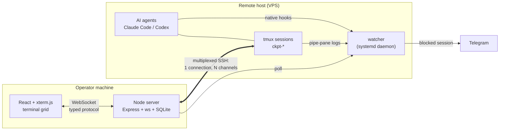

# Prana OPS

**Remote agent console — operations layer for long-running AI coding agents.**
Knows when an agent is *blocked waiting on you* — and tells you, even when nothing is open.

<!-- TODO: 20s GIF — Telegram notification arrives, operator answers from the panel, agent resumes -->

---

## The problem

You give an autonomous coding agent a task, it runs for an hour in a `tmux` session on a
remote box, and at some point it stops and asks a question.

Nobody notices.

The session is alive. SSH is `ESTAB`. The health check returns 200. The agent is simply
*sitting there*, and the only signal that anything is wrong is the absence of progress —
which looks exactly like an agent that is thinking hard.

This is a monitoring problem with an unusual shape: the thing you need to detect is a
**full-screen TUI that has gone quiet**, and "quiet" means three completely different
things (working, waiting, finished) that you cannot tell apart from the outside.

Prana OPS is the layer that tells them apart.

## What it does

- **Terminal grid** (1/2/4/6 panes, xterm.js) over `tmux` sessions on remote hosts. One SSH
  connection per host, multiplexed into N channels — growing into a bounded pool only when the
  server refuses a channel (ADR 003).
- **A watcher daemon** on the remote host that classifies every session as
  `thinking` / `waiting_for_input` / `idle` / `error` — and escalates.
- **Telegram notification** when a session needs you, with the question inline.
- **Answer from the panel** — the reply is delivered into the session via `tmux send-keys`, and
  the session resumes. Notification is outbound only; replies come back through the console.

The terminal grid is the part you look at. The watcher is the part that matters.

## Architecture



The server never stores secrets: SSH keys are referenced **by path only**, and the SQLite
database holds host, port, user and key path — never key material, never a password.

## The detection ladder

State is decided by three layers of decreasing reliability and increasing cost. A layer only
runs when the ones above it have nothing to say.

| Layer | Mechanism | Reliability | Cost | Fails to |
|---|---|---|---|---|
| **1** | Native agent hooks (`Notification`, `Stop`, permission requests) → HTTP POST | Ground truth — the agent says so itself | free | agents without hook support |
| **2** | Regex scanner over continuous `pipe-pane` logs, with dedup windows | Heuristic — pattern matching on rendered TUI output | free | novel phrasings, redraw noise |
| **3** | LLM classifier over the tail of the log | Judgment — handles what regex cannot | paid | nothing; it is the floor |

Three properties of this design are worth more than the ladder itself:

**Layer 1 outranks Layer 2, permanently.** A `waiting_for_input` written by a hook cannot be
demoted by the scanner. This sounds obvious and was a production bug: the scanner would
overwrite a hook-confirmed "waiting" with "idle" within seconds, because the guard only held
for a single scan cycle. Sessions sat blocked for two hours while the UI showed calm.
→ [ADR: layer precedence](docs/adr/002-layer-precedence.md)

**Absence of signal is not calm.** A session with no telemetry renders as *unknown* (`⃠`), not
as "fine". A monitoring system that reports health it cannot observe is worse than no
monitoring, because it actively suppresses the operator's suspicion.
→ [ADR: absence of signal](docs/adr/001-absence-of-signal.md)

**Layer 3 is capped and optional.** Daily call ceiling, per-call timeout, and if the three
config variables are absent the layer **disables itself silently** — the system degrades to
two working layers instead of erroring. LLM inference is treated as an expensive dependency
that may not be there, not as a foundation.

## Design decisions

Written as ADRs, each with the production evidence that forced it:

| # | Decision | Why it exists |
|---|---|---|
| [001](docs/adr/001-absence-of-signal.md) | Absence of signal renders as unknown, never as healthy | The UI asserted calm over sessions it had no telemetry for |
| [002](docs/adr/002-layer-precedence.md) | Hook-sourced state outranks heuristic state | Scanner demoted hook-confirmed `waiting_for_input` in seconds |
| [003](docs/adr/003-ssh-channel-ceiling.md) | Connection pool with a *learned* channel ceiling | OpenSSH `MaxSessions` limits channels **per TCP connection**, not connections — so `ssh host` from a terminal kept working while the cockpit silently could not open sessions |
| [004](docs/adr/004-boot-failure-must-be-loud.md) | `EADDRINUSE` on bind exits; it is not a recoverable error | A global `uncaughtException` guard kept a portless server alive, writing a fatal error on every boot and poisoning later diagnosis |
| [005](docs/adr/005-untrusted-input-at-the-boundary.md) | Loopback is a network boundary, not a trust boundary | WebSocket is exempt from same-origin policy, so any page in any tab could speak the protocol — and the session-name guard checked a prefix, not a grammar |

ADR 003 is the one worth reading if you only read one: the obvious evidence pointed the wrong
way for a full morning, and the fix learns the server's ceiling at runtime rather than
hardcoding a number that differs per host. ADR 005 is the most uncomfortable: a defect that
survived tests, types and review, found by auditing the claims this README was making.

## Testing

```
482 tests · 3 workspaces · ~4s
```

| Workspace | Tests | Approach |
|---|---|---|
| `server` | 216 | Transport is mocked end to end — **no test opens a real SSH connection**. Saturation, refusal and reconnection are reproduced with a fake client that refuses channels the way `sshd` does. |
| `web` | 155 | Component tests over the typed WebSocket protocol |
| `watcher` | 111 | Includes a replay of the exact production timeline that exposed the precedence bug |

Boot behaviour is covered by spawning the real entrypoint on an ephemeral port with a
temporary database, which is how the `EADDRINUSE` path is tested without touching anything
that is running.

## Running it

**Requirements:** Linux, Node 18+, an SSH key on disk, and a remote host with `tmux`.
`better-sqlite3` and `ssh2` compile native binaries during install.

```bash
npm install
npm run dev          # builds the SPA, serves the backend on 127.0.0.1:4000
```

The watcher is deployed separately to the remote host (see `watcher/DEPLOY.md`). It is
optional: without it you get the terminal grid, but none of the state detection.

## Security posture

There is no authentication, so the trust model has to be stated precisely rather than assumed.

- **Loopback only, enforced.** A non-loopback `HOST` is refused at boot instead of honoured.
  Reaching the console from elsewhere is expected to go through an SSH tunnel or a private
  network — exposing it would require authentication first.
- **The `Origin` header is validated on WebSocket upgrade.** Loopback keeps other machines
  out; it does not keep the browser out, and WebSocket has no same-origin protection. Without
  this check, any page in any open tab could speak the protocol. See ADR 005.
- **Session names are validated as a grammar** (`^ckpt-[A-Za-z0-9_-]+$`), not a prefix, and
  every value is shell-quoted on the way into a command. The allowlist is enforced at command
  construction, so no code path can target a session the operator created by hand.
- **SSH private keys** are never read into the database, never transmitted and never logged —
  only their path is stored.
- **Watcher secrets** (notification token, LLM key) live in an env file with mode `600` on the
  remote host — never in the repository, never in the database.

## Non-goals

This is an opinionated system built for a specific way of working, and it is more useful
being explicit about that than pretending to be general:

- **Not a hosted service.** It runs on your machine and talks to your hosts.
- **Not multi-user.** One operator, no accounts, no RBAC.
- **Not an agent framework.** It does not orchestrate agents or write prompts; it operates
  sessions that agents happen to run in.
- **Not a terminal emulator worth choosing on its own.** If you only want terminals in a
  browser, `ttyd` and `wetty` exist and are better at it.

## Status

Built in 18 days and used daily in production by its author to operate real client work.
Both planned phases are shipped: the session cockpit, and the decision-detection pipeline
that motivated it.

A written case study of the development — the diagnoses that were wrong, the premise refuted by
instrumentation, the feature rejected after being designed — is in preparation. The decisions it
covers are already recorded as ADRs above.

## A note on the code comments

Comments carry markers like `Story 2.14` or `AC5`. Those are internal work-item
ids — the project was built story-by-story and the markers survived. They point at
nothing you are missing: every comment states its own reasoning, and the decisions
worth reading are the ADRs above.

Comments and test names are in Portuguese. That is the author's working language;
the architecture documents, this README and the ADRs are in English.

## Stack

TypeScript on the server and the web app; the remote watcher is dependency-light ESM JavaScript
with a single runtime dependency. Node · Express · `ws` · `ssh2` · `better-sqlite3` on the
server; React · Vite · xterm.js on the front end.
